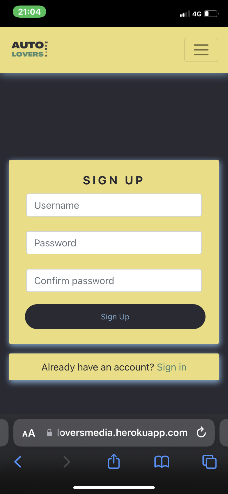
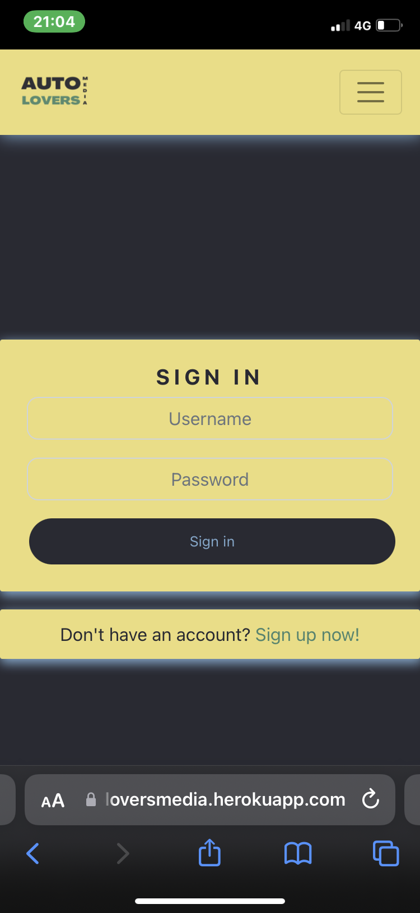
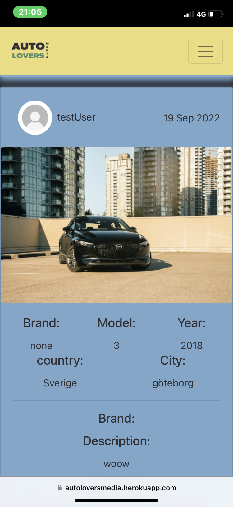
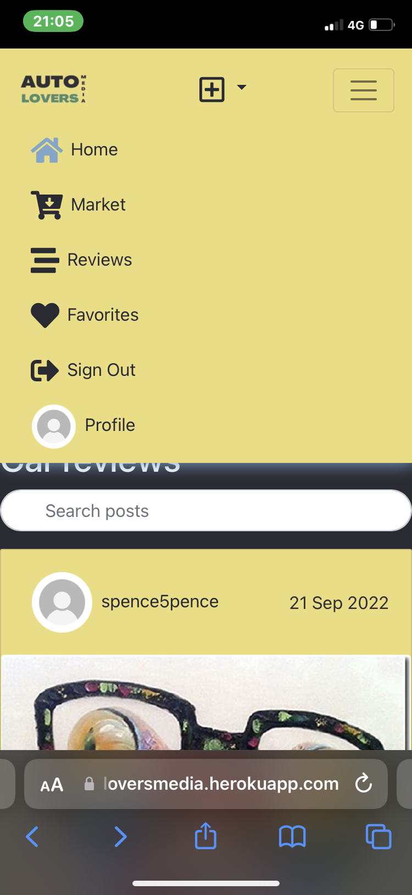
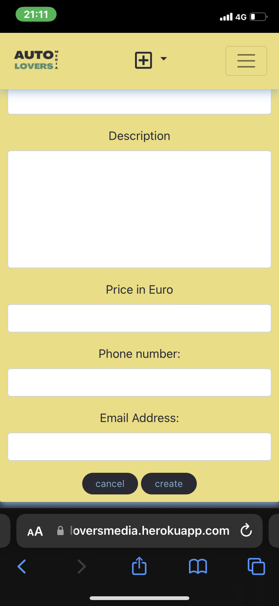
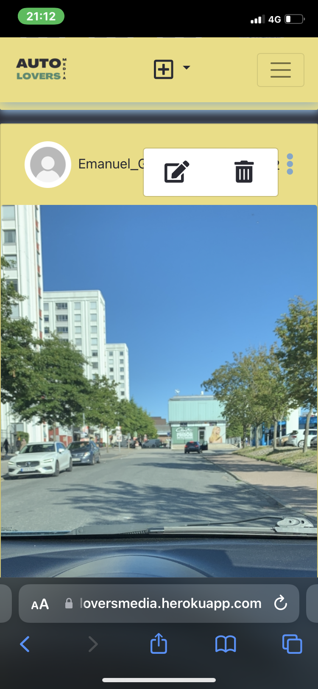
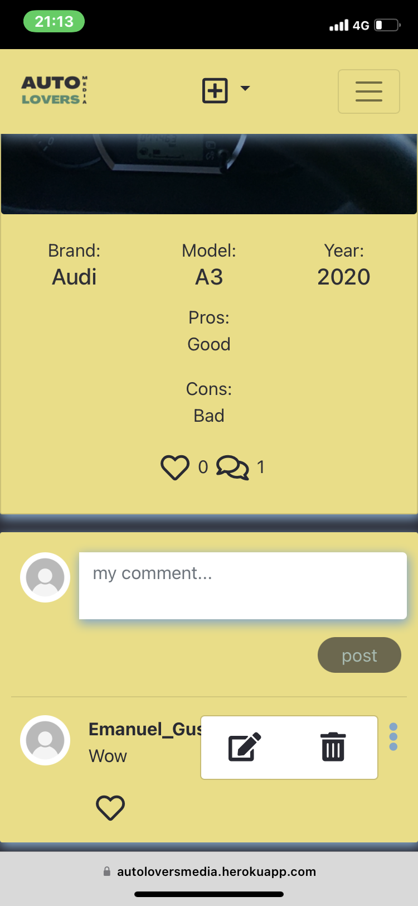
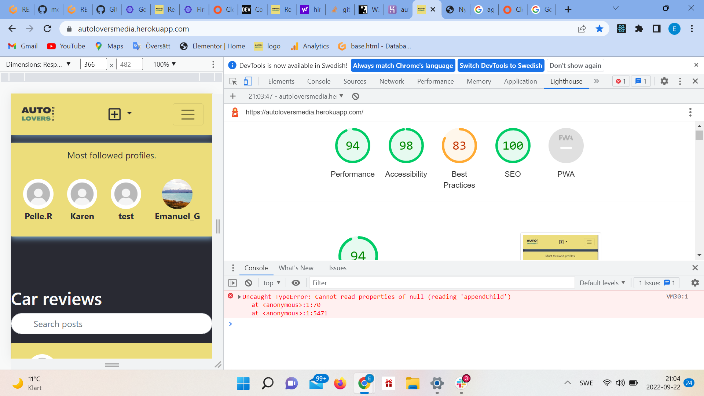

# Autolovers API
Autolovers is the backend, the api for the webiste Autolovers Media. As you can hear it is a site for people who loves cars. It is a social media platform where users can review cars and share with the community. A user can create reviews, like and comment reviews, like comments, follow each other and even advertise cars for sale. This api is built with Django and django restframework.

## Press at this link https://autolovers.herokuapp.com/ to see the deployed api. by adding the app name in the end of the url you can access the json data for each app. For example https://autolovers.herokuapp.com/review

## Ux Design

### Site purpose
The purpose of this site is for people who loves cars to learn more by reading reviews and help other to learn more about cars by writing reviews. Users can even sell cars.

### Audience
This site is for anyone who are intrested in cars or maybe even not that intrested but are about to buy a car and want some more information. I imagine people who has a driving licance wants to visit the site so people from age 18 and up. 

### Communication
I wanted a layout to communicate action and taht is why I have the yellow color combined with black mostly on the website.

## agile methodology
follow the link: https://github.com/users/EmanuelGustafzon/projects/5
## Logged in vs Logged out user
As a logged out user you can view reviews and market and as a logged in user you can create, edit and delete reviews and advertisments of your car. You can follow other users and see your followers reviews. You can like reviews, create, edit and delete comments and like comments.

## Features

### Login
 
### Register
 
### home page
 
 ### Market page
 
  ### Review page
 
   ### Navbar
 
  ### most popular profiles
 
   ### Create review
 
   ### Sell car
 
   ### Update and delete car for sale and review. 
 
   ### Update comment, update, delete, and like comments
 
   ### Update profile, username and password and follow and unfollow profile.
 
   ### See a profiles reviews and ads.
 
 

## Manuel testing
  - Test that unlogged in users cannot create a review or market.
  - Test that users who are not owner of a review or advertisments can edit the review or market.
  - Test that users who are not the owner of a comment can edit a comment.
  - Test that users cannot like its own review or comment.
  - Test that users can not edit someone elses profile.
  - Test that users can register, login and logout saftly and without errors.
  - Test that users create, read, update and delete reviews, advertisments and comments without errors.
  - Test that the infinite scroll is working for reviews, advertisments and comments. 
  - Test like button for reviews and comments.
  - Test refreshtokens so users can stay logged in for 24 hours.
  - Test that the database is updating correctly accoring to users interactions on the page. 

## Lighthouse
 

## Problems with testing
Because of poor knowledge of how to use Eslint it caused a problem in the gitpod workspace because node_modules in the project folder. I would like to fix this and do a proper test but as I did not have any tutor hours left for the week I could not. This also affect the test for css. There is a style folder with a color hex number with a # left out wich leads to an error. I fixed this but because of the propblem with Eslint i cannot redeploy the site at heroku. 

## Technolgy used
  - HTML5
  - CSS3
  - JavaScript
  - Python 
  - SQL - Postgres

## Frameworks, Libraries & Programs Used
  - Font Awesome
  - Gitpod and GitHub
  - Favicon
  - Django
  - React-Bootsrtap
  - ReactJs

## Reusage of components
  - Asset.js includes a loading spinner that is placed on several pages.
  - axiosDefaults.js is a component reused on several pages to communicate with the backend.
  - MoreDropDown.js is reused on reviews and market ads, comments and profiles to update and delete.
  - CurrentUserContet.js is used on the pages where loggedout users are not allowed to access. The components confirms that the user is logged in.
  - ProfileDataContext.js is used for users to follow and unfollow profiles on several pages.
  - useRedirect.js redrect users to another page if they are not authorised to be there.
  - utils.js is used to enable users to use the infinite scroll function on reviews, comments and market.

## bugs
- I had problems with logging out from the page, this was fixed by adding a logout view in the api.

## unfixed bugs
- As I already have written, a bug appeared in the last moment when trying to use EsHint.

## Deployment

- Gitpod workspace was used for this project.
- In the workspace I installed React.js by the comands: npx create-react-app . --use-npm and then npm start to see the preview.
- Installed the packages I needed with the commands npm install:
  - react-bootstrap@1.6.3 bootstrap@4.6.0
  - react-router-dom@5.3.0
  - axios
  - react-infinite-scroll-component
  - msw --save-dev
  - jwt-decode
- Push all the changes to github with git add . && git commit -m 'commit' and finaly git push.
- Connect the react app with the backend in heroku by adding Key: CLIENT_ORIGIN | Value: https://react-app-name.herokuapp.com and Key: CLIENT_ORIGIN_DEV | Value: https://gitpod-browser-link.ws-eu54.gitpod.io in the config vars.
- Add axiosDefaults.js and connect to the backend.
- Add "heroku-prebuild": "npm install -g serve", in package.json 
- Add procfile with following code: web: serve -s build.
- Finally push all the changes to GitHub and go to heroku and deploy the site. 

## Credits
- Code Institute documentation was used for the project.
- Support from the tutors and slack.
- Stackoverflow and diffchecker. 

